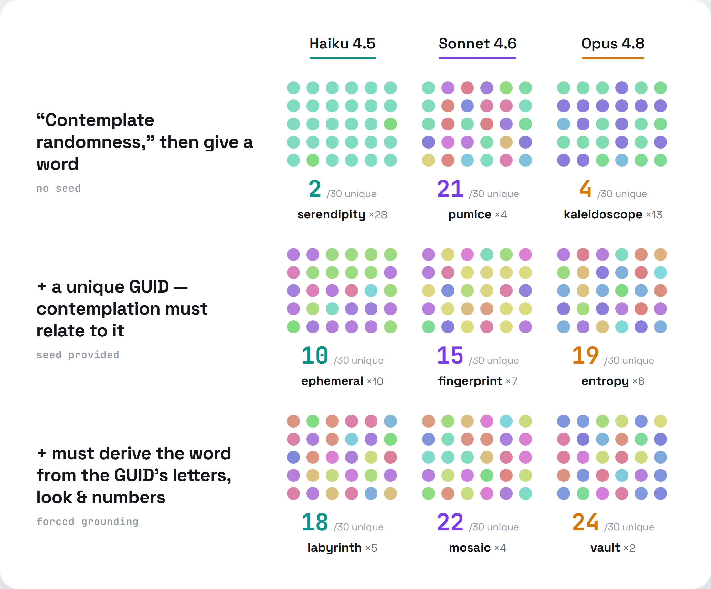

# Can an LLM pick a random word? 🎲

A small experiment with a surprisingly stubborn answer: **no — not really.**

Ask Claude for "a single random word" enough times and it doesn't sample the dictionary. It reaches for the *same* favorite word, over and over. This repo runs that experiment across three Claude models (Haiku 4.5, Sonnet 4.6, Opus 4.8), 30 calls each, and watches what it takes to actually break the model out of its rut.



> **Each dot is one of 30 answers. Same colour = same word.**
> A solid block means the model kept repeating itself. Confetti means real variety.

---

## TL;DR

- 🔁 **Models are bad at randomness.** Asked 30 times, plain, they return only **3–4 unique words** — and famously favor **`serendipity`** and **`luminous`**.
- 🧠 **Bigger ≠ more random.** Forced to emit a single structured field, **Opus 4.8 answered `serendipity` 30/30 times** — a literal constant function. The most capable model was the *least* random.
- ✍️ **A "reasoning" field is the entropy source.** Letting the model write a sentence before answering is what creates variety — remove it and it collapses.
- 🏷️ **The field's *name* steers behavior.** A field called `contemplate_randomness` made Sonnet deliberately diversify, but made Haiku & Opus philosophize their way back to one favorite.
- 🌈 **Real variety needs real grounding.** Only when forced to derive the word from a unique GUID's *actual letters and numbers* did diversity peak — **Opus 4.8 hit 24/30 unique.**

---

## The experiment

Base prompt:

```
come up with a single random word
```

Then we iterate — adding structured JSON output, a per-call GUID seed, and a reasoning field — to see what moves the needle. Every run is **30 independent API calls per model** (no shared context, no prompt caching). Words are grouped **in code**, never by eyeballing.

### The headline run: plain prompt, 30×

| Model | Unique / 30 | What it kept saying |
|-------|:-----------:|---------------------|
| Haiku 4.5  | 4 | luminescence ×10, luminescent ×8, serendipity ×7 |
| Sonnet 4.6 | 3 | **luminous ×25**, vellichor, luminary |
| Opus 4.8   | 3 | banana ×16, serendipity ×13, pineapple |

Three "random" words out of thirty tries. The bias is stable, not noise — re-running reproduces the same favorites.

### The collapse: structured output, `single_word` only

Force the model to fill a bare JSON field `{ "single_word": string }` — no room to think:

| Model | Unique / 30 |
|-------|:-----------:|
| Haiku 4.5  | 4 |
| Sonnet 4.6 | 6 |
| **Opus 4.8** | **1 — `serendipity` ×30** |

Opus became a constant. 🤯

### The fix: ground it in a GUID's actual content

Give each call its own GUID and **force** the model to derive the word from the GUID's letters, look, and numbers (with a short, mandatory `contemplate_randomness` field). Now the reasoning is real and per-seed:

> `'da' opens like dawn` → **Daybreak**
> `'d13c' suggests 'disc'` → **discordance**
> `'4454' looks like a staircase` → **Stratum**
> `doubled 'a2a2' … echoing footsteps` → **corridor**

| Model | Unique / 30 |
|-------|:-----------:|
| Haiku 4.5  | 18 |
| Sonnet 4.6 | 22 |
| **Opus 4.8** | **24** |

The model that was a constant function three steps ago is now the *most* diverse — because the entropy comes from the seed, not from the model "trying to be random."

---

## The progression in one picture

The hero image at the top compares the **last three structured-output runs** — the "contemplation" arc:

| # | Prompt variant | Haiku | Sonnet | Opus |
|---|----------------|:-----:|:------:|:----:|
| 01 | “Contemplate randomness,” then give a word (no seed) | 2 | 21 | 4 |
| 02 | + a unique GUID, contemplation must relate to it | 10 | 15 | 19 |
| 03 | + derive the word from the GUID's letters & numbers | 18 | 22 | **24** |

Watch the dots go from a solid block to confetti. 🎉

---

## Why this happens

LLMs don't have a random number generator — they sample from a probability distribution. "Pick something random" surfaces the **highest-probability token that fits**, which is the same every time. `serendipity` and `luminous` aren't random; they're each model's *favorite idea of a random word*.

Temperature only shuffles *within* that tiny favorite set. The only way to genuinely diversify the output is to inject real entropy the model must respond to — here, a unique GUID it's forced to interpret. Even then, the models will happily admit the bytes carry *"no inherent semantic meaning"* — they're improvising a story, not decoding the seed.

---

## Run it yourself

```bash
npm install
cp .env.example .env      # add your ANTHROPIC_API_KEY
node experiment.mjs       # all 3 models × 3 prompt conditions, 30 calls each
```

Pass a count to change the sample size: `node experiment.mjs 50`.

Requires Node.js 20+ (uses the built-in `process.loadEnvFile()`). Built on the official [`@anthropic-ai/sdk`](https://github.com/anthropics/anthropic-sdk-typescript).

It's a single self-contained script (`experiment.mjs`) that runs the three prompt conditions — plain, structured `single_word`, and GUID-grounded — across all three models and prints each spread. Grouping is done in code; **prompt caching is off** (caching wouldn't change outputs anyway).

---

## Models tested

| Model | ID |
|-------|----|
| Claude Haiku 4.5  | `claude-haiku-4-5`  |
| Claude Sonnet 4.6 | `claude-sonnet-4-6` |
| Claude Opus 4.8   | `claude-opus-4-8`   |

---

*Built as a quick curiosity. The funniest result remains Opus 4.8 confidently answering `serendipity` thirty times in a row.* ✨
